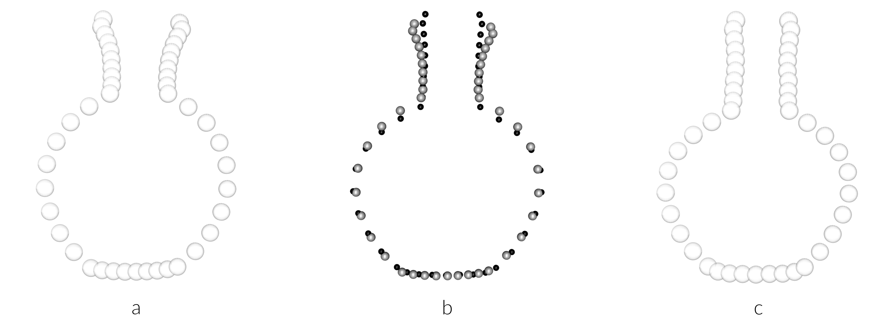

# peru.bottle.jar

View analysis at: [https://seldenlab.github.io/peru.bottle.jar/](https://seldenlab.github.io/peru.bottle.jar/)

**The Changing Shape of Empire: A GM Study of Chimu Bottles in Museum Collections**

After centuries of looting along Peru's North Coast, archaeologists acknowledge that the pottery of the Chimu Empire is one of the most collected Andean artifacts, but also one of the most poorly understood. Much of the enduring classificatory uncertainty comes from the problematic provenance of most Chimu vessels, and the fact that the distinctive blackware identified as Chimu represents the production of workshops from across an extensive area, during periods of regional political decentralization (c. 900-1200 CE), imperial growth (c. 1200-1450), and foreign conquest by the Inca (c. 1450-1535) and Spanish (after 1532) empires. This chapter builds on previous seriations and field observations, using geometric morphometric analysis of a sample of 3D-scanned Chimu bottles from publicly held collections at the University of Texas (Austin) and the American Museum of Natural History. Since Chimu bottles were formed in workshops using molds, variations in vessel shape can serve as indicators of variable practices. We compare a sample of common Chimu blackware bottles with a sample of "Inca-Chimu" vessels that carry features typical of the short Inca occupation of the North Coast. Differences between the two samples offer new lines of evidence that can guide more precise classifications of these vessels, as well as new interpretations of the imperial history of Peru's North Coast.

## Primary findings

### Linear metrics

 * Bottles and jars **differ significantly** in orifice diameter
 * Bottles and jars **differ significantly** in belly diameter
 * Bottles and jars **differ significantly** in rim thickness
 
 

### Geometric morphometrics

 * Bottles and jars **differ significantly** in shape
 * Bottles and jars do not differ in size
 

