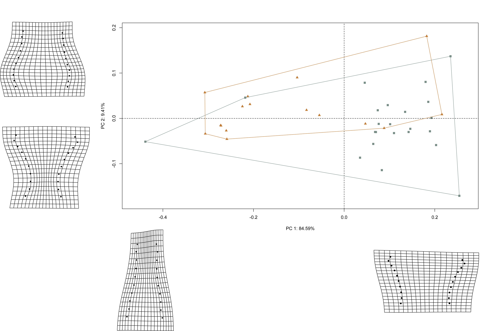
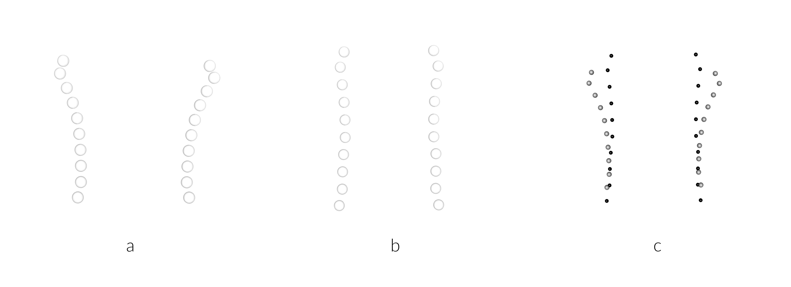

# 3DGM: Neck morphology

## Load packages + data

```{r load.data.s, echo = TRUE}
# load packages
library(here)
library(geomorph)
library(tidyverse)
library(wesanderson)

# read GM data
source('readmulti.csv.R')
setwd("./data")
filelist <- list.files(pattern = ".csv")
coords <- readmulti.csv(filelist)
setwd("../")

# read qualitative data
qdata <- read.csv("qdata.csv", 
                  header = TRUE, 
                  row.names = 1)

qdata <- qdata[match(dimnames(coords)[[3]],
                     rownames(qdata)),]
```

## Generalised Procrustes Analysis

Landmark data were aligned to a global coordinate system [@RN11622;@RN11623;@RN11563], achieved through generalised Procrustes superimposition [@RN478] performed in R 4.0.3 [@R] using the `geomorph` library v. 3.3.2 [@RN11530;@RN1774]. Procrustes superimposition translates, scales, and rotates the coordinate data to allow for comparisons among objects [@RN11564;@RN478]. The `geomorph` package uses a partial Procrustes superimposition that projects the aligned specimens into tangent space subsequent to alignment in preparation for the use of multivariate methods that assume linear space [@RN1646;@RN11563]. 

```{r gpa.s, out.width = "100%", dpi = 300, echo=TRUE, warning=FALSE}
#select landmarks associated with neck
a <- c(1:10, 36:45)

# new coords neck
neck.coords <- coords[a,,]

# gpa
Y.gpa <- gpagen(neck.coords, 
                PrinAxes = TRUE, 
                ProcD = TRUE, 
                Proj = TRUE, 
                print.progress = FALSE)

# geomorph data frame
gdf <- geomorph.data.frame(shape = Y.gpa$coords, 
                           size = Y.gpa$Csize,
                           type = qdata$type)

# render 3d gpa plot
plot(Y.gpa)

# gpa plot
#knitr::include_graphics('images/gpa3d.png')

# add centroid size to qdata
qdata$csz <- Y.gpa$Csize

# print updated qdata with centroid size
knitr::kable(qdata, 
             align = "lccccc", 
             caption = "Modified attributes included in qdata.")
```

### Boxplot

```{r box1.s, out.width = "100%", dpi = 300, echo=TRUE, warning=FALSE, fig.cap = "Boxplot of centroid size by spatial/temporal unit."}
# attributes for boxplot
csz <- qdata$csz
type <-  qdata$type

# palette
pal <- wes_palette("Moonrise2")

# boxplot of vessel centroid size by type
csz.type <- ggplot(qdata, aes(x = type, y = csz, color = type)) + 
  geom_boxplot(notch = FALSE) +
  geom_dotplot(binaxis = 'y', stackdir = 'center', dotsize = 0.3) +
  scale_colour_manual(values = pal) +
  theme(legend.position = "none") +
  theme(axis.text.x = element_text(angle = 90, vjust = 0.5, hjust=1)) +
  labs(x = 'Type (Neck)', 
       y = 'Centroid Size')

# render plot
csz.type
```

## Principal Components Analysis

Principal components analysis [@RN1746] was used to visualise shape variation among bottle and jar necks. The shape changes described by each principal axis are commonly visualised using thin-plate spline warping of a reference 3D mesh [@RN1731;@RN479]. 

```{r gmpca.s, out.width = "100%", dpi = 300, echo=TRUE, warning=FALSE}
# principal components analysis
pca<-gm.prcomp(Y.gpa$coords)
summary(pca)

# set plot parameters (types)
pch.gps.type <- c(15,17)[as.factor(type)]
col.gps.type <- wes_palette("Moonrise2")[as.factor(type)]
col.hull.type <- c("#798E87","#C27D38")

# plot pca by comb
pc.plot.type <- plot(pca, 
                 asp = 1,
                 pch = pch.gps.type,
                 col = col.gps.type)
                    shapeHulls(pc.plot.type, 
                             groups = type,
                             group.cols = col.hull.type)
```

### Minima/maxima of PC1/2 with warp grids

```{r min.max.neck, echo=TRUE, out.width = "100%", dpi = 300, warning=FALSE}
# plot x/y maxima/minima
## x - minima
ref <- mean.shape <- mshape(Y.gpa$coords)
plotRefToTarget(M1 = ref, 
                M2 = pca$shapes$shapes.comp1$min, 
                method = "TPS")

plotRefToTarget(M1 = ref, 
                M2 = pca$shapes$shapes.comp1$max, 
                method = "TPS")

plotRefToTarget(M1 = ref, 
                M2 = pca$shapes$shapes.comp2$min, 
                method = "TPS")

plotRefToTarget(M1 = ref, 
                M2 = pca$shapes$shapes.comp2$max,
                method = "TPS")
```

```{r pca.warp.ne, out.width = "100%", dpi = 300, echo=TRUE, warning=FALSE, fig.cap="Results of PCA summarising shape variation in bottle necks, gray; and jar necks, orange; with shapes + warp grids for maxima/minima of each axis."}
# pca warp neck                   

```

## Neck size and shape

A residual randomisation permutation procedure (RRPP; n = 10,000 permutations) was used for all Procrustes ANOVAs [@RN1655;@RN11775], which has higher statistical power and a greater ability to identify patterns in the data should they be present [@RN1719]. To assess whether shape changes differ by type (geography and time), Procrustes ANOVAs [@RN1749] were also run that enlist effect-sizes (zscores) computed as standard deviates of the generated sampling distributions [@RN1756].

```{r def.mod.1.s, out.width = "100%", dpi = 300, echo=TRUE, warning=FALSE}
# neck size as a function of vessel form (bottle/jar)?
fit.size.type <- procD.lm(size ~ type,
                            data = gdf,
                            print.progress = FALSE,
                            iter = 9999)

# Procrustes ANOVA: do neck sizes differ as a function of vessel form?
anova(fit.size.type)

# neck shape as a function of vessel form?
fit.shape.type <- procD.lm(shape ~ type,
                data = gdf,
                print.progress = FALSE,
                iter = 9999)

# Procrustes ANOVA: do neck shapes differ as a function of vessel form?
anova(fit.shape.type)
```

## Mean shapes

```{r mshape.s, out.width = "100%", dpi = 300, echo=TRUE, warning=FALSE, fig.cap="Mean shapes for bottles (a), jars (b), and comparison of bottle (gray) and jar (black) neck shapes (c)."}
# subset landmark coordinates to produce mean shapes
new.coords<-coords.subset(A = Y.gpa$coords,
                          group = qdata$type)
names(new.coords)

# type shape means
mean <- lapply(new.coords, mshape)

# plot mean shapes (type)
plot(mean$bottle)
plot(mean$jar)

# comparison plots
plotRefToTarget(mean$bottle,
                mean$jar, 
                method = c("points"),
                mag = 1)


```
