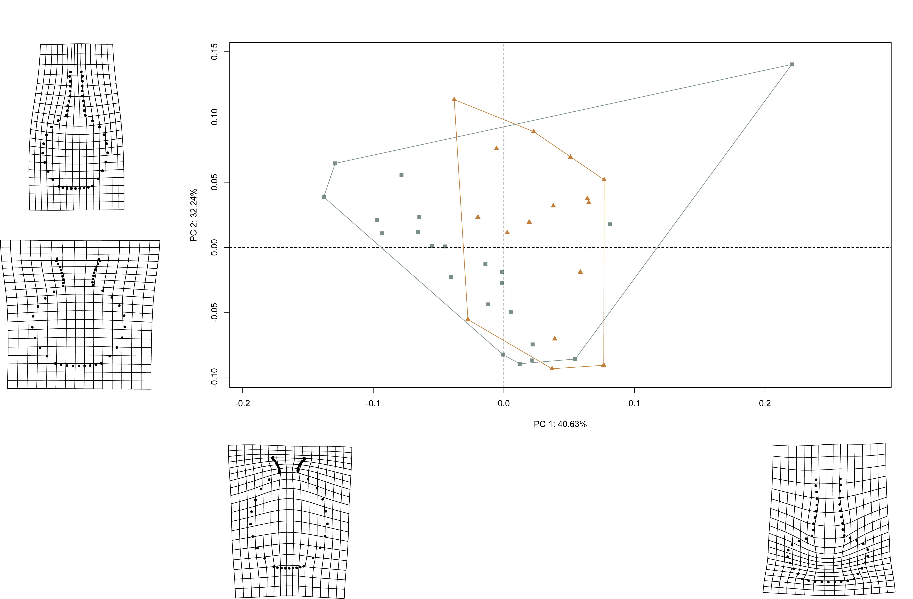

# Vessel Forms and Elements

## Load packages + data

```{r load.data6, echo = TRUE}
# load packages
#devtools::install_github("mlcollyer/RRPP")
#devtools::install_github("geomorphR/geomorph", ref = "Stable", build_vignettes = TRUE)
library(here)
library(geomorph)
library(tidyverse)
library(wesanderson)

# read GM data
source('readmulti.csv.R')
setwd("./data2")
filelist <- list.files(pattern = ".csv")
coords <- readmulti.csv(filelist)
setwd("../")

# read qualitative data
qdata <- read.csv("qdata.csv", 
                  header = TRUE, 
                  row.names = 1)

qdata <- qdata[match(dimnames(coords)[[3]],
                     rownames(qdata)),]

qdata <- qdata %>% 
  unite("merged", group:type, remove = FALSE)

# exclude phytomorph - need multiples
# result = analysis will compare bottles and jars adorned with anthropomorph 
# and zoomorph decorative elements
qdata <- filter(qdata, group != "phytomorph")
```

## Generalised Procrustes Analysis

Landmark data were aligned to a global coordinate system [@RN11622;@RN11623;@RN11563], achieved through generalised Procrustes superimposition [@RN478] performed in R 4.0.3 [@R] using the `geomorph` library v. 3.3.2 [@RN11530;@RN1774]. Procrustes superimposition translates, scales, and rotates the coordinate data to allow for comparisons among objects [@RN11564;@RN478]. The `geomorph` package uses a partial Procrustes superimposition that projects the aligned specimens into tangent space subsequent to alignment in preparation for the use of multivariate methods that assume linear space [@RN1646;@RN11563]. 

```{r gpa6, out.width = "100%", dpi = 300, echo=TRUE, warning=FALSE}
# gpa
Y.gpa <- gpagen(coords, 
                PrinAxes = TRUE, 
                ProcD = TRUE, 
                Proj = TRUE, 
                print.progress = FALSE)

# geomorph data frame
gdf <- geomorph.data.frame(shape = Y.gpa$coords, 
                           size = Y.gpa$Csize,
                           merged = qdata$merged)

# render 3d gpa plot
#plot(Y.gpa)

# gpa plot
#knitr::include_graphics('images/gpa3d.png')

# add centroid size to qdata
qdata$csz <- Y.gpa$Csize

# print updated qdata with centroid size
knitr::kable(qdata, 
             align = "lccccc", 
             caption = "Modified attributes included in qdata.")
```

### Boxplot

```{r box16, out.width = "100%", dpi = 300, echo=TRUE, warning=FALSE, fig.cap = "Boxplot of centroid size by spatial/temporal unit."}
# attributes for boxplot
csz <- qdata$csz
merged <- qdata$merged

pal <- wes_palette("Moonrise2")

# boxplot of vessel centroid size by merged
csz.type <- ggplot(qdata, aes(x = merged, y = csz, color = merged)) + 
  geom_boxplot() +
  geom_dotplot(binaxis = 'y', stackdir = 'center', dotsize = 0.3) +
  scale_colour_manual(values = pal) +
  theme(legend.position = "none") +
  theme(axis.text.x = element_text(angle = 90, vjust = 1, hjust=1)) +
  labs(x = 'Group', y = 'Centroid Size')

# render plot
csz.type
```

## Principal Components Analysis

Principal components analysis [@RN1746] was used to visualise shape variation among the bottles. The shape changes described by each principal axis are commonly visualised using thin-plate spline warping of a reference 3D mesh [@RN1731;@RN479]. 

```{r gmpca6, out.width = "100%", dpi = 300, echo=TRUE, warning=FALSE}
# principal components analysis
pca<-gm.prcomp(Y.gpa$coords)
summary(pca)

# set plot parameters (types)
pch.gps.type <- c(0:3)[as.factor(merged)]
col.gps.type <- pal[as.factor(merged)]
col.hull.type <- c("#C27D38","#CCC591","#29211F","#798E87")

# plot pca by comb
pc.plot.type <- plot(pca,
                     asp = 1,
                     pch = pch.gps.type,
                     col = col.gps.type)
shapeHulls(pc.plot.type,
           groups = merged,
           group.cols = col.hull.type)
```

### Minima/maxima of PC1/2 with warp grids

```{r min.max.botjar6, echo=TRUE, out.width = "100%", dpi = 300, warning=FALSE}
# plot x/y maxima/minima
## x - minima
ref <- mean.shape <- mshape(Y.gpa$coords)
plotRefToTarget(M1 = ref, 
                M2 = pca$shapes$shapes.comp1$min, 
                method = "TPS")

plotRefToTarget(M1 = ref, 
                M2 = pca$shapes$shapes.comp1$max, 
                method = "TPS")

plotRefToTarget(M1 = ref, 
                M2 = pca$shapes$shapes.comp2$min, 
                method = "TPS")

plotRefToTarget(M1 = ref, 
                M2 = pca$shapes$shapes.comp2$max,
                method = "TPS")
```

```{r pca.warp.botjar6, out.width = "100%", dpi = 300, echo=TRUE, warning=FALSE, fig.cap="Results of PCA summarising shape variation in bottles, gray; and jars, orange; with shapes + warp grids for maxima/minima of each axis."}
# pca warp                   
#
```

## Vessel size and shape

A residual randomisation permutation procedure (RRPP; n = 10,000 permutations) was used for all Procrustes ANOVAs [@RN1655;@RN11775], which has higher statistical power and a greater ability to identify patterns in the data should they be present [@RN1719]. To assess whether shape changes differ by group (geography and time), Procrustes ANOVAs [@RN1749] were also run that enlist effect-sizes (zscores) computed as standard deviates of the generated sampling distributions [@RN1756].

```{r def.mod.16, out.width = "100%", dpi = 300, echo=TRUE, warning=FALSE}
# size as a function of merged?
fit.size.merged <- procD.lm(size ~ merged,
                data = gdf,
                print.progress = FALSE,
                iter = 9999)

# Procrustes ANOVA: do sizes differ?
anova(fit.size.merged)

# shape as a function of merged?
fit.shape.merged <- procD.lm(shape ~ merged,
                data = gdf,
                print.progress = FALSE,
                iter = 9999)

# Procrustes ANOVA: do shapes differ?
anova(fit.shape.merged)
```

## Morphological disparity

```{r disparity6, out.width = "100%", dpi = 300, echo=TRUE, warning=FALSE}
# morphological disparity: do either of the groups display greater 
# size variation among individuals relative to the other group?
morphol.disparity(fit.size.merged, 
                  groups = qdata$merged, 
                  data = gdf, 
                  print.progress = FALSE, 
                  iter = 9999)

# morphological disparity: do either of the groups display greater 
#shape variation among individuals relative to the other group?
morphol.disparity(fit.shape.merged, 
                  groups = qdata$merged, 
                  data = gdf, 
                  print.progress = FALSE, 
                  iter = 9999)
```

## Mean shapes

```{r mshape.h16, out.width = "100%", dpi = 300, echo=TRUE, warning=FALSE}
# subset landmark coordinates to produce mean shapes
new.coords<-coords.subset(A = Y.gpa$coords,
                          group = qdata$merged)
names(new.coords)

# group shape means
mean <- lapply(new.coords, mshape)

# plot mean shapes (type)
plot(mean$anthropomorph_bottle)
plot(mean$anthropomorph_jar)
plot(mean$zoomorph_bottle)
plot(mean$zoomorph_jar)

# comparison plots
plotRefToTarget(mean$anthropomorph_bottle, 
                mean$zoomorph_bottle, 
                method = c("points"),
                mag = 1)

plotRefToTarget(mean$anthropomorph_jar, 
                mean$zoomorph_jar, 
                method = c("points"),
                mag = 1)

#knitr::include_graphics('images/mshape.png')
```
